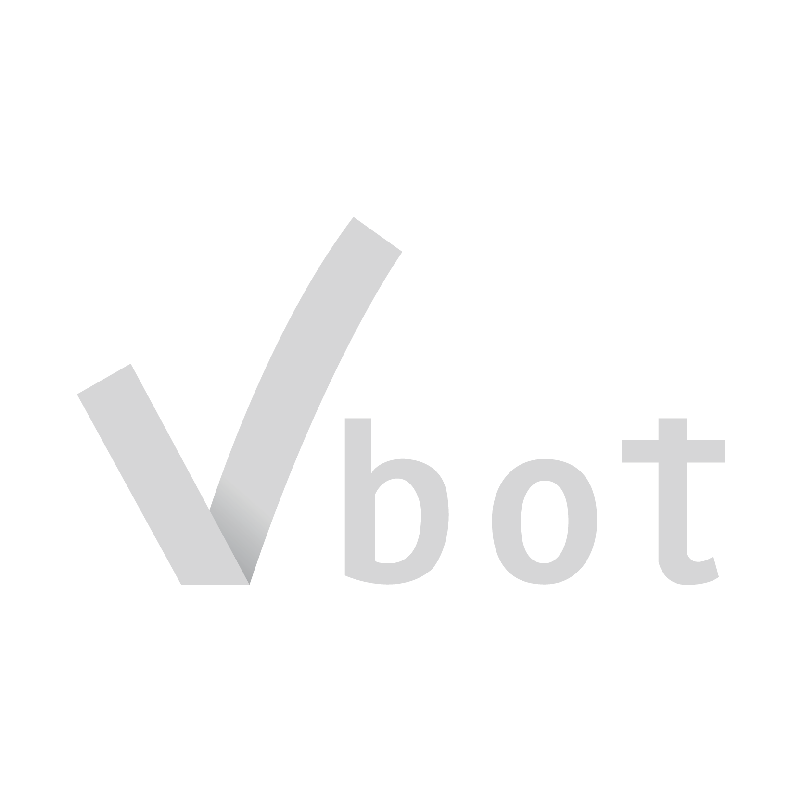
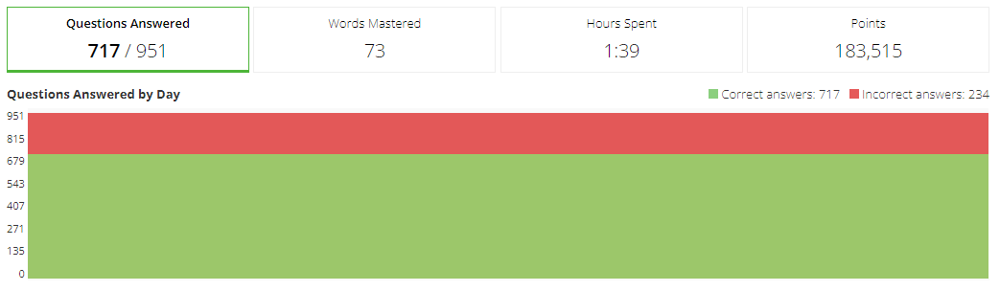
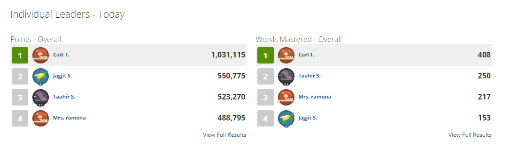

# AutoVocab
<!-- <p align="center"> -->

<!-- </p> -->

This python bot leverages ChatGPT to automatically retrieve correct answers for Vocabulary.com's practice mode questions, and returns the answers using their API. making homework assignments a breeze to complete in minutes.


## Features

- Utilizes ChatGPT for free (using poe-api)
- Custom run duration (1 hour default)
- Compatible with any public vocabulary list
- Harder to detect
- Fast bot


## Installation

Install autoVocab with pip:

```bash
git clone https://github.com/rodatboat/autoVocab.git
cd autoVocab
pip install -r requirements.txt
```
    
## Documentation

Example can be found in `main.py`. To run the example just modify `config.py` with your specifications.

```
poe_session_token = "P-B HERE"
vocab_session_token = "JSESSIONID HERE"
vocab_aws = "AWSALB HERE"
guid = "GUID HERE"
listId = -1 # LIST ID HERE
```

### Finding Your Tokens

#### poe-api
- `poe_session_token` - Check the [poe-api](https://github.com/ading2210/poe-api) GitHub repository for instructions on getting the value of the cookie.

#### vocabulary.com

Check browser cookies for vocabulary.com, and paste the following cookies:
- `vocab_session_token` = `JSESSIONID`
- `vocab_aws` = `AWSALB`
- `guid` = `guid`
##### 
Enter a valid vocabulary list.
- `listId` - ID of vocabulary list to complete.


```bash
python main.py
```


## Lessons Learned

What did you learn while building this project? What challenges did you face and how did you overcome them?


## Usage/Examples

```python
import poe, time, random
import autoVocab
import config

poe_session_token = config.poe_session_token
vocab_session_token = config.vocab_session_token
vocab_aws = config.vocab_aws
guid = config.guid
listId = config.listId

vocabClient = autoVocab.Client(vocab_session_token, vocab_aws, guid)

vocabClient.start_from_list(listId)
message = vocabClient.formatQuestion()

# I'm lazy and added this, because some answers are given with the question.
if not message.startswith("=+="):
  for ai_answer in client.send_message("chinchilla", message, with_chat_break=True):
    pass
  text_answer = ai_answer["text"].replace(".", "")
else:
    text_answer = message.replace("=+=","")

# Sleep to avoid spam detection
sleep_time = round(random.uniform(0, 4), 3)

vocabClient.answer_question(text_answer)
```

## Demo

The bot has a ~90% accuracy answering questions. Most of the errors come from me not adding a way to find the correct answer to picture practice questions. By changing the sleep time (see example under `main.py`) between requests we can increase the points per hour. However, it can get you flagged as spam/guessing by their system.


Results after testing the for several hours:


## Acknowledgements

 - [Used these devlogs to learn more about vocabulary.com API](https://github.com/williamyeny/vocabulary-com-script)

 

 ##
 
 I do not advice you use this bot, use at your own risk. Vocabulary.com and poe.com will detect you eventually and suspend your accounts.
